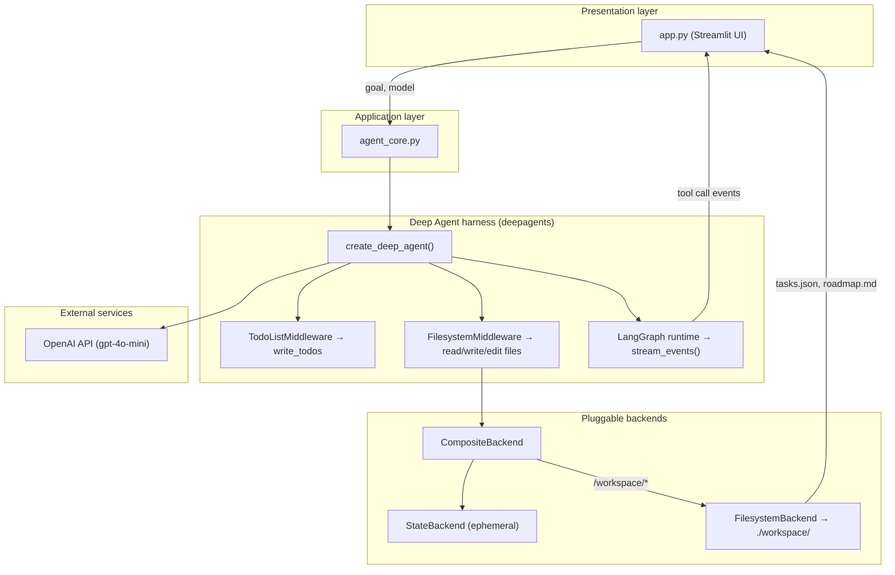
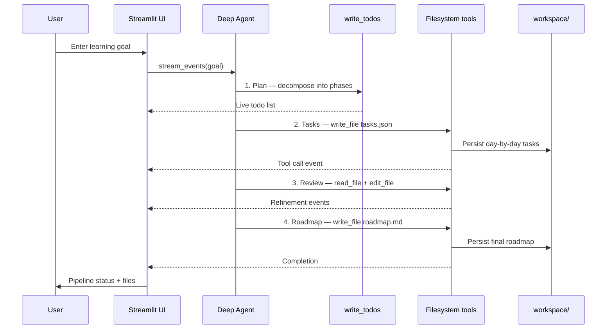

# Deep Agent Todo Planner

An educational demo that uses [LangChain Deep Agents](https://docs.langchain.com/oss/python/deepagents/overview) and the OpenAI API to turn a learning goal into a structured plan, day-by-day tasks, and a final roadmap.

**Example input:** `I want to learn Python in 30 days.`

The agent plans, writes files to a local workspace, reviews its own output, and produces a readable roadmap — all through built-in Deep Agent harness tools.

---

## Architecture



### Agent pipeline



---

## Project structure

```
Deep Agent/
├── agent_core.py      # Agent setup, backend routing, event streaming
├── app.py             # Streamlit dashboard
├── requirements.txt
├── .env.example       # Copy to .env and add your API key
├── workspace/         # Agent output (tasks.json, roadmap.md) — gitignored
└── venv/              # Python virtual environment — gitignored
```

---

## Deep Agent concepts used

| Concept | Where | Purpose |
|---------|-------|---------|
| **Agent harness** | `create_deep_agent()` | Bundles planning, filesystem, and context tools out of the box |
| **TodoListMiddleware** | `write_todos` tool | Breaks a long goal into trackable phases |
| **FilesystemMiddleware** | `write_file`, `read_file`, `edit_file` | Creates and refines plan artifacts |
| **CompositeBackend** | `agent_core.make_backend()` | Routes `/workspace/` to disk, keeps harness internals ephemeral |
| **FilesystemBackend** | `workspace/` folder | Persists `tasks.json` and `roadmap.md` on local disk |
| **StateBackend** | Default route | In-memory storage for internal agent data |
| **Event streaming** | `stream_events(version="v3")` | Powers the live UI pipeline and activity log |
| **LangGraph runtime** | Under the hood | Multi-step tool loop with durable execution |

---

## Setup

### 1. Create a virtual environment

```powershell
cd "Deep Agent"
python -m venv venv
.\venv\Scripts\Activate.ps1
pip install -r requirements.txt
```

### 2. Configure OpenAI

```powershell
copy .env.example .env
```

Edit `.env` and set your key (UTF-8, one line):

```
OPENAI_API_KEY=sk-your-actual-key
```

> **Windows tip:** Save `.env` as UTF-8 in Notepad. UTF-16 encoding causes `embedded null character` errors.

### 3. Run the UI

```powershell
streamlit run app.py
```

Open the URL shown in the terminal (usually `http://localhost:8501`).

---

## What the UI shows

1. **Pipeline** — five steps (Plan → Tasks → Store → Review → Roadmap) with live status
2. **Live activity** — each harness tool call as it happens
3. **Tasks JSON** — structured day-by-day tasks from `tasks.json`
4. **Roadmap** — rendered `roadmap.md`
5. **Workspace** — raw files the agent wrote to disk

---

## Expected workspace output

After a successful run, the agent writes:

| File | Description |
|------|-------------|
| `workspace/tasks.json` | Day-by-day tasks with title, day, duration, status |
| `workspace/roadmap.md` | Overview, weekly milestones, resources, and tips |

These files are regenerated on each run and are not committed to git.

---

## Requirements

- Python 3.11+
- OpenAI API key
- Dependencies: `deepagents`, `langchain-openai`, `python-dotenv`, `streamlit`

---

## License

Educational demo — not intended for production use.
